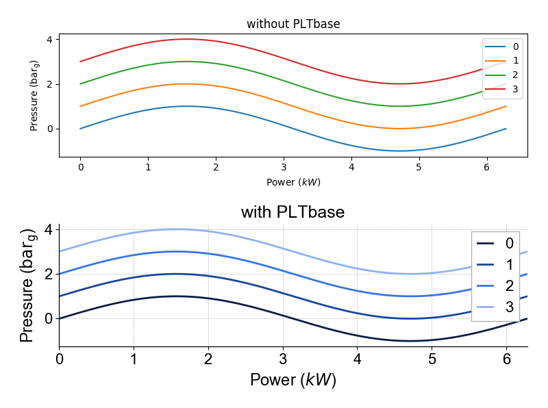

|doc| |build|

-----

mplstyle
-----

**mplstyle** is a Python package, which allows **matplotlib** users to simplify the process of improving plots' quality. Quite often font, size, legend, colors and other settings should be changed for making plots look better. Such changes can be remembered and stored in your own style, which can automatically change the way of making plots by importing it as a usual Python toolbox. In other words, with **mplstyle** you can set plotting settings once and use created configuration many times.

Screenshot
-----

Dependencies
~~~~~~~~~~~~~

  - [matplotlib](http://matplotlib.org/)
  - [cycler](http://matplotlib.org/cycler/)
  - [numpy](http://www.numpy.org/)
  
Installation
~~~~~~~~~~~~~

  - from GitHub: `pip install git+https://github.com/tzipperle/mplstyle.git@master`
  - from source: `pip . install`

Useful settings: Custom directory for own packages
~~~~~~~~~~~~~

Add the package `mplstyle` automatically to sys.path:

1. Create a directory anywhere, e.g. `C:\Users\Name\Documents\Python\Libs`.
2. Add the file `sitecustomize.py` to the site-packages folder of the Python installation, i.e. in `C:\Anaconda3\Lib\site-packages` (for all users) or site.USER_SITE (for a single user).
3. This file then is filled with the following code:

.. code-block:: python

      import site
      site.addsitedir(r'C:\Users\Name\Any\Folder\You\Like\Libs')

4. The directory now is automatically added to sys.path in every (I)Python session.

Package site, that is automatically imported during every start of Python, also tries to import the package sitecustomize for custom package path modifications.

Source: [Stack Overflow](http://stackoverflow.com/q/17806673/2375855)

.. |doc| image:: https://readthedocs.org/projects/mplstyle/badge/?version=latest
        :alt: Documentation
        :target: http://mplstyle.readthedocs.io/en/latest/?badge=latest

.. |build| image:: https://travis-ci.org/tzipperle/mplstyle.svg?branch=master
        :alt: Build Status
        :target: https://travis-ci.org/tzipperle/mplstyle
