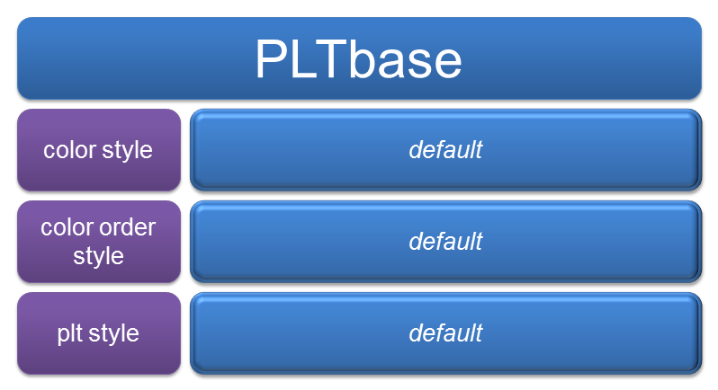

.. currentmodule:: mpl-style

.. _overview:

Overview
============
**Mpl-style** is a Python package, which allows **matplotlib** users to simplify the process of improving plots' quality. Quite often font, size, legend, colors and other settings should be changed for making plots look better. Such changes can be remembered and stored in your own plot style, which can automatically change the way of making plots by importing it as a usual Python toolbox. In other words, with **mpl-style** you can set plotting settings once and use created configuration many times.           

The core of **mpl-style** is a **PLTbase** class contained list of functions, which change initial settings of **matplotlib**. Figure 1 illustrates these changes by plotting several trigonometric functions with and without **PLTbase**.   

.. figure:: img/with_without.png
   :width: 90%
   :align: center
   
   Figure 1: Plotting changes by applying **PLTbase** class
   
All changes are distributed between three settings: **color style**, **color order style** and **plt style**. Each of them according to **PLTbase** has only one way of rewriting initial corresponding **matplotlib** setting. This way is called a **default** style. Figure 2 illustrates above mentioned **PLTbase** structure. 

   
   Figure 2: **PLTbase** class structure

   

   

