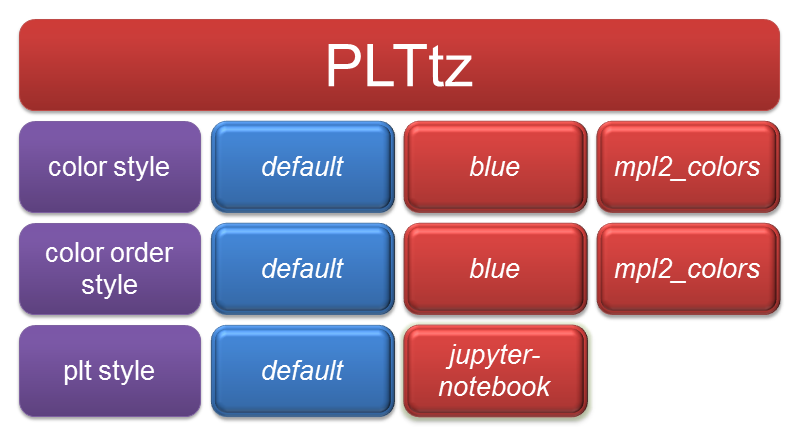

.. currentmodule:: mplstyle

.. _overview:

.. _overview-ref:

Overview
============
**mplstyle** is a Python package, which allows **matplotlib** users to simplify the process of improving plots quality. Quite often font, size, legend, colors and other settings have to be changed to make graphs look better. Such changes can be saved and stored in your own plot style, which can automatically change the way of making plots by importing it as a usual Python toolbox. In other words, with **mplstyle** you can set plotting settings once and use your own configurations.

The core of **mplstyle** is a **PLTbase** class containing a list of functions, which change the initial settings of **matplotlib**. :ref:`plt_with_without` Figure 1 illustrates these changes by plotting several trigonometric functions with and without the **PLTbase**.

.. _plt_with_without:

.. figure:: img/with_without.png
   :width: 90%
   :align: center

   Figure 1: Plotting changes by applying **PLTbase** class

Three settings can be changed: **color style**, **color order style** and **plt style**.  When using **PLTbase** each setting will be applied to become the new default setting. Figure 2 illustrates the above-mentioned **PLTbase** structure.

.. figure:: img/PLTbase.png
   :width: 70%
   :align: center

   Figure 2: **PLTbase** class structure

In addition to the **PLTbase** there are five more classes: **PLTdatabay**, **PLTdynamis**, **PLTenfo**, **PLTewk** and **PLTtz**. Each class inherits the functionality of the **PLTbase** class and contains different styles of reconfiguring the initial settings. The structure of one of these classes is presented in Figure 3.

   Figure 3: **PLTtz** class structure

As can be seen **PLTtz** preserves **PLTbase** styles and contains additionals styles. The remaining classes (Figure 3 in red) have the same structure, but with their own additional styles.
