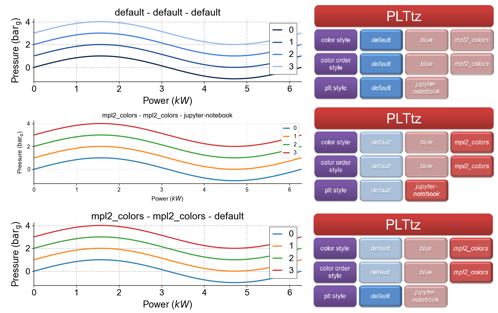

.. currentmodule:: mpl-style

.. _use:

How to Use
========================

This section explains and shows how any of the classes from **mpl-style** can be used. **PLTtz** class, which was already mentioned in the :ref:`overview <overview>`, is taken as an example. Its implementation in the ``trigonometric_functions.py`` is explained very detailed by moving step by step through the script. Other classes are used completely similar.

trigonometric_functions.py
"""""""""""""""""""""""
Several trigonometric functions are plotted thrice in this file with three different configurations of plot settings. All plots with chosen configuration are presented in the end. Detailed comments of the script are in the following.  

::

    import matplotlib.pyplot as plt
    import numpy as np
    import os
    import sys
    
Four packages are included: 

* `matplotlib.pyplot`_ is a plotting library which allows present results in a diagram form quite easily;
* `numpy`_ is the fundamental package for scientific computing with Python;
* `os`_ is the module for using operating system according to its functionality in a portable way;
* `sys`_ is the module, which provides access to variables and functions used by the interpreter. 

::

    sys.path.append(os.path.split(os.path.dirname(os.getcwd()))[-2])
    
This command allows to use **mpl-style** for the case, when the package wasn't added to Python search path. This step is really necessary, if, for example, you have just `downloaded`_ or cloned (with `git`_) this repository to a directory of your choice, and you want to run codes inside this directory trying to figure out how **mpl-style** is working. 

.. note::

	
        The procedure of adding **mpl-style** package to the sys.path, which will allow to include it as installed site-package, is written here. 

::

    from mpl_style.PLT_tz import PLTtz
    tz_plt=PLTtz()

Imports **PLTtz** class from a file ``PLT_tz.py``, where this class is described as a child of **PLTbase**. Then creates an instance of the class and assigns it to the local variable **tz_plt**.

.. note::

	
        When a new initialized instance of the chosen class is obtained, all three settings (**color style**, **color order style** and **plt style**) are immediately rewritten. Since this moment each setting works according to its own 'default' style, kept in **PLTbase** class. 
        
::

    fig = plt.figure(figsize=[8,9])
    
Chooses the size of the figure, where three plots will be printed. 

::

	#1st plot
	#########
	ax0 = fig.add_subplot(211)

	#setting four trigonometric functions and plotting them 
	x = np.arange(0, 2 * np.pi, 0.01)
	for c in range(4):
    		y = np.sin(x) + c
    		ax0.plot(x, y, label=c)

	#labeling axises, putting legend and title 
	ax0.set_title('default - default - default')
	ax0.set_ylabel(r'Pressure ($\mathrm{bar}_{\mathrm{g}}$)')
	ax0.set_xlabel(r'Power ($kW$)')
	ax0.legend()
	
Makes 1st plot by choosing its location on the figure, setting trigonometric functions and configuring additional parameters. 

::

	#2nd plot
	#########
	#changing all plot settings
	tz_plt.set_style(color_style='mpl2_colors')
	tz_plt.set_style(color_order_style='mpl2_colors')
	tz_plt.set_style(plt_style='jupyter-notebook')
	
Changes each plot setting by **set_style()** function. Since now the initial configuration (**default - default - default**) is changed on the new one (**mpl2_colors - mpl2_colors - jupyter-notebook**).

::

	ax1 = fig.add_subplot(312)

	x1 = np.arange(0, 2 * np.pi, 0.01)
	for c1 in range(4):
    		y1 = np.sin(x1) + c1
    		ax1.plot(x1, y1, label=c1)

	ax1.set_title('mpl2_colors - mpl2_colors - jupyter-notebook')
	ax1.set_ylabel(r'Pressure ($\mathrm{bar}_{\mathrm{g}}$)')
	ax1.set_xlabel(r'Power ($kW$)')
	ax1.legend()
	
Does similar operations for making 2nd plot. 

::

	#3rd plot
	#########
	#changing plt_style setting
	tz_plt.set_style(plt_style='default')
	
Starts work with 3rd plot by changing only **plt_style** setting. According to it, configuration changes only partially from old (**mpl2_colors - mpl2_colors - jupyter-notebook**) to new (**mpl2_colors - mpl2_colors - default**).

::

	ax2 = fig.add_subplot(313)

	x2 = np.arange(0, 2 * np.pi, 0.01)
	for c2 in range(4):
    		y2 = np.sin(x2) + c2
    		ax2.plot(x2, y2, label=c2)

	ax2.set_title('mpl2_colors - mpl2_colors - default')
	ax2.set_ylabel(r'Pressure ($\mathrm{bar}_{\mathrm{g}}$)')
	ax2.set_xlabel(r'Power ($kW$)')
	ax2.legend()

	fig.tight_layout()
	plt.show()

Makes 3rd plot similar to 1st and 2nd. Then shows all three together. Figure 4 illustrates these three plots with their respective configurations.

   
   Figure 4: Comparison of three identical plots made with three different configurations

.. _numpy: https://docs.scipy.org/doc/numpy-dev/user/index.html
.. _matplotlib.pyplot: https://matplotlib.org/index.html
.. _os: https://docs.python.org/3/library/os.html#module-os
.. _sys: https://docs.python.org/3/library/sys.html
.. _git: http://git-scm.com/
.. _downloaded: https://github.com/tzipperle/mpl-style/archive/master.zip

