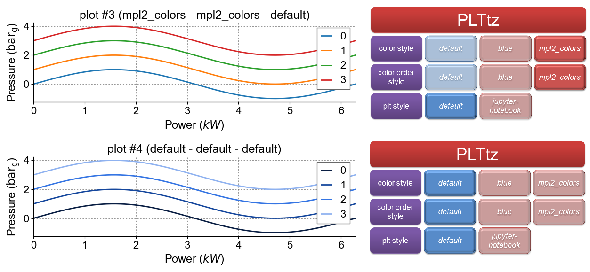

.. currentmodule:: mplstyle

.. _use:

How to Use
========================

This section explains and shows how the **mplstyle** class can be used. **PLTtz** class, mentioned in the :ref:`overview <overview>`, is used as an example. Its implementation in the ``trigonometric_functions.py`` is explained in detail by going step by step through the script. The other classes are used similarly.

trigonometric_functions.py
"""""""""""""""""""""""
Several trigonometric functions are plotted in this file, showing the change in the current configuration of plot settings each time. All plots with chosen configurations are split between two figures presented at the middle and in the end of the description. Detailed comments on the script are in the following.

::

    import matplotlib.pyplot as plt
    import numpy as np
    import os
    import sys

Four packages are included:

* `matplotlib.pyplot`_ is a plotting library which enable presenting results graphically;
* `numpy`_ is the basic package for scientific computing with Python;
* `os`_  provides a portable way of using operating system dependent functionality;
* `sys`_ provides access to variables and functions used by the Python interpreter.

::

    from mplstyle.tz import PLTtz
    tz_plt=PLTtz()

The command above imports **PLTtz** class from file ``tz.py``, where this class is described as a child of **PLTbase**. It then creates an instance of the class and assigns it to the local variable **tz_plt**.

.. note::

        When a new initialized instance of the chosen class is obtained, all three settings (**color style**, **color order style** and **plt style**) are immediately rewritten. As of this moment each setting works according to its own **default** style, in the **PLTbase** class.

::

    fig1 = plt.figure(figsize=[8, 6])
    fig2 = plt.figure(figsize=[8, 6])

The code block above chooses the size of two figures, where three plots will be printed.

::

	#1st plot
	#########
	ax0 = fig1.add_subplot(211)

	#setting four trigonometric functions and plotting them
	x = np.arange(0, 2 * np.pi, 0.01)
	for c in range(4):
    		y = np.sin(x) + c
    		ax0.plot(x, y, label=c)

	#labeling axises, putting legend and title
	ax0.set_title('default - default - default')
	ax0.set_ylabel(r'Pressure ($\mathrm{bar}_{\mathrm{g}}$)')
	ax0.set_xlabel(r'Power ($kW$)')
	ax0.legend()

This creates the first plot by choosing its location on the first figure, setting trigonometric functions and configuring additional parameters.

::

	#2nd plot
	#########
	#changing all plot settings
	tz_plt.set_style(color_style='mpl2_colors')
	tz_plt.set_style(color_order_style='mpl2_colors')
	tz_plt.set_style(plt_style='jupyter-notebook')

Changes each plot setting by **set_style()** function. Since now the initial configuration (**default - default - default**) is changed on the new one (**mpl2_colors - mpl2_colors - jupyter-notebook**).

::

	ax1 = fig1.add_subplot(212)

	x1 = np.arange(0, 2 * np.pi, 0.01)
	for c1 in range(4):
    		y1 = np.sin(x1) + c1
    		ax1.plot(x1, y1, label=c1)

	ax1.set_title('mpl2_colors - mpl2_colors - jupyter-notebook')
	ax1.set_ylabel(r'Pressure ($\mathrm{bar}_{\mathrm{g}}$)')
	ax1.set_xlabel(r'Power ($kW$)')
	ax1.legend()

	fig1.tight_layout()
	plt.show()

Does similar operations for making 2nd plot. Figure 4 illustrates these two plots with their respective configurations written in the title and placed near each plot.

.. figure:: img/ddd-mmj.png
   :width: 100%
   :align: center

   Figure 4: Comparison of two identical plots made with initial and specifically chosen configurations

As can be seen from above written script, with **set_style()** function any from three plot settings (**color style**, **color order style** and **plt style**) can be changed quite easily. Other part of the script is described below.

::

	#3rd plot
	#########
	#changing only plt_style setting
	tz_plt.set_style(plt_style='default')

Starts work with 3rd plot by changing only **plt_style** setting. According to it, configuration changes only partially from old (**mpl2_colors - mpl2_colors - jupyter-notebook**) to new (**mpl2_colors - mpl2_colors - default**).

::

	ax2 = fig2.add_subplot(212)

	x2 = np.arange(0, 2 * np.pi, 0.01)
	for c2 in range(4):
    		y2 = np.sin(x2) + c2
    		ax2.plot(x2, y2, label=c2)

	ax2.set_title('mpl2_colors - mpl2_colors - default')
	ax2.set_ylabel(r'Pressure ($\mathrm{bar}_{\mathrm{g}}$)')
	ax2.set_xlabel(r'Power ($kW$)')
	ax2.legend()

Makes 3rd plot similar to 1st and 2nd.

::

	#4rth plot
	#########
	#changing all plot settings with one function
	tz_plt.set_style('default')

Uses **set_style()** function once for changing all plot settings (**color style**, **color order style** and **plt style**) simultaneously to their own **default** style.

::

	ax3 = fig2.add_subplot(212)

	x3 = np.arange(0, 2 * np.pi, 0.01)
	for c3 in range(4):
    		y3 = np.sin(x3) + c3
    		ax3.plot(x3, y3, label=c3)

	ax3.set_title('mpl2_colors - mpl2_colors - default')
	ax3.set_ylabel(r'Pressure ($\mathrm{bar}_{\mathrm{g}}$)')
	ax3.set_xlabel(r'Power ($kW$)')
	ax3.legend()

	fig2.tight_layout()
	plt.show()

Does similar to previous operations for making the 4th plot. 3rd and 4th plots are presented in the figure 5 with their respective configurations written in the title and placed near each plot.

   Figure 5: Comparison of two identical plots made with two different configurations

Comparing 2nd and 3rd plots partial change in the configuration can be observed. From the part of script dedicated to the 4th plot can be seen, that **set_style()** function also allows to change all plot settings at one time. Only the name of the style without mentioning a specific parameter (**color style**, **color order style** and **plt style**) should be written in brackets for such change.

.. note::

        All three settings (**color style**, **color order style** and **plt style**) can be changed at one time with **set_style()** function only to the style, which exists for all of them. The command won't work, if at least one plot setting doesn't have a style with name mentioned in brackets.

.. _numpy: https://docs.scipy.org/doc/numpy-dev/user/index.html
.. _matplotlib.pyplot: https://matplotlib.org/index.html
.. _os: https://docs.python.org/3/library/os.html#module-os
.. _sys: https://docs.python.org/3/library/sys.html
